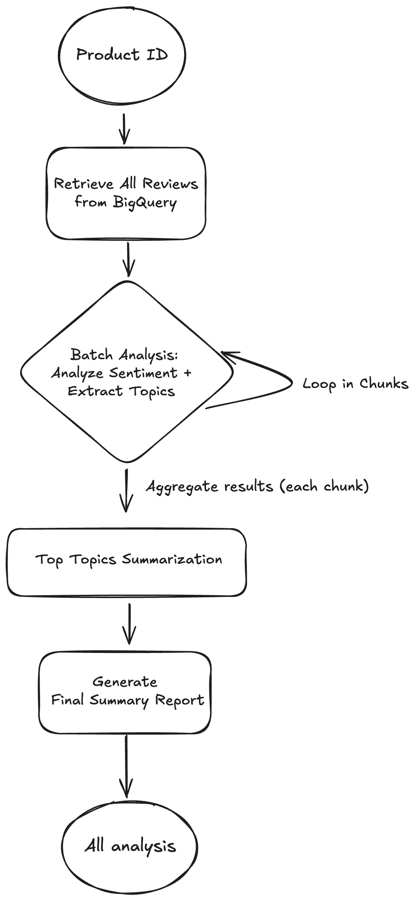

# End-to-End MLOps: Customer Feedback Analysis Platform


This project is a full-stack, cloud-native application designed to ingest, process, and analyze customer feedback at scale. It leverages a modern data engineering pipeline and a sophisticated AI agent to automatically derive business insights—such as sentiment trends and key topics—from raw, unstructured review data. The results are served through an interactive web dashboard.

This platform demonstrates a complete, end-to-end MLOps workflow, from large-scale data processing with Apache Spark to automated CI/CD and deployment on a serverless cloud architecture.

### Architecture Diagram


### AI Agent (LangGraph) Structure
 

## Features

-   **Robust Data Pipeline:** Ingests raw data from GCS, processes it at scale with **Apache Spark on Dataproc**, and stores structured results in **Google BigQuery**.
-   **Autonomous AI Agent:** Uses **LangGraph** and the **Gemini API** to perform a multi-step analysis chain:
    -   🔍 Fetches relevant data from the BigQuery warehouse.
    -   😊 Performs sentiment analysis and topic extraction on all reviews in a single, efficient batch call.
    -   📊 Aggregates results to identify key positive and negative themes.
    -   ✍️ Generates a concise, executive-level summary of the findings.
-   **Interactive Dashboard:** A **React** frontend with data visualizations using **Recharts** to clearly present the sentiment breakdown and topic frequency.
-   **Automated MLOps:** A complete **CI/CD pipeline** using **GitHub Actions** for automated building, containerization, and deployment.
-   **Scalable Cloud-Native Deployment:** The entire application is containerized with **Docker** and deployed on **Google Cloud Run**, with the API running as a scalable service and the background worker running as a dedicated job.

## Getting Started Locally (Docker Compose)

### Prerequisites
- Docker and Docker Compose
- Google Cloud SDK (`gcloud`) authenticated locally (`gcloud auth application-default login`)
- A GCP project with the BigQuery API enabled.
- A service account key file (`gcp-credentials.json`) in the project root with **BigQuery User** permissions.

### Step 1: Set Up Environment File
In the `backend/` directory, create a `.env` file from the example and add your secrets:
```env
GEMINI_API_KEY="your-gemini-key"
LANGSMITH_API_KEY="your-langsmith-key"
GCP_PROJECT_ID="your-gcp-project-id"

# For local worker to connect to the Redis container
REDIS_URI="redis://localhost:6379"
```

### Step 2: Run the Application
From the project root, run the Docker Compose command:
```bash
docker-compose up --build
```
In a **separate terminal**, start the local worker to process jobs:
```bash
python run_worker.py
```
The application will be available at **`http://localhost:8123/app/`**.

## Deployment to Google Cloud

This application is designed for automated deployment to **Google Cloud Run** via a CI/CD pipeline defined in **GitHub Actions**.

### One-Time Infrastructure Setup
1.  **Enable APIs**: In your GCP project, enable the **Artifact Registry**, **Cloud Run Admin**, **Cloud SQL**, and **Serverless VPC Access** APIs.
2.  **Create Cloud SQL (Postgres)**: Provision a PostgreSQL instance and set a password for the `postgres` user.
3.  **Create Redis on GCE**: Provision a small GCE VM (e.g., `e2-micro`), install Docker, and run the `redis:6` container.
4.  **Create VPC Connector**: Create a Serverless VPC Access connector in the same region as your other services.
5.  **Create Firewall Rule**: Create a firewall rule to allow **ingress** traffic from the VPC Connector's IP range to your Redis VM on TCP ports `6379` and `5432`.
6.  **Create Artifact Registry Repo**: Create a **Docker** repository to store your container images.

### CI/CD Pipeline Setup
1.  **Create a GCP Service Account**: Create a service account with the following roles: `Artifact Registry Writer`, `Cloud Run Admin`, `Serverless VPC Access User`, `Compute Network User`. Download its JSON key.
2.  **Add GitHub Secrets**: In your repository settings, add the following secrets:
    - `GCP_PROJECT_ID`: Your Google Cloud Project ID.
    - `GCP_SA_KEY`: The content of the service account JSON key.
    - `GEMINI_API_KEY`: Your Gemini API key.
    - `LANGSMITH_API_KEY`: Your LangSmith API key.
    - `REDIS_URI`: The connection string for your Redis VM (e.g., `redis://PRIVATE_IP:6379`).
    - `DATABASE_URI`: The connection string for your Cloud SQL instance.
3.  **Update Workflow**: In `.github/workflows/main.yml`, replace the placeholder values (like `YOUR_VPC_CONNECTOR_NAME`) with your actual resource names.

Once configured, any push to the `main` branch will automatically build and deploy the application to Google Cloud Run.

## Technologies Used

-   **Frontend:** React, Vite, Tailwind CSS, Recharts
-   **Backend:** Python, FastAPI, LangGraph, RQ
-   **AI/ML:** Google Gemini
-   **Data Storage:** Google BigQuery, PostgreSQL, Redis
-   **MLOps & Deployment:** Docker, GitHub Actions (CI/CD), Google Cloud Run, Artifact Registry, Google Compute Engine

## License

This project is licensed under the Apache License 2.0. See the [LICENSE](LICENSE) file for details.
