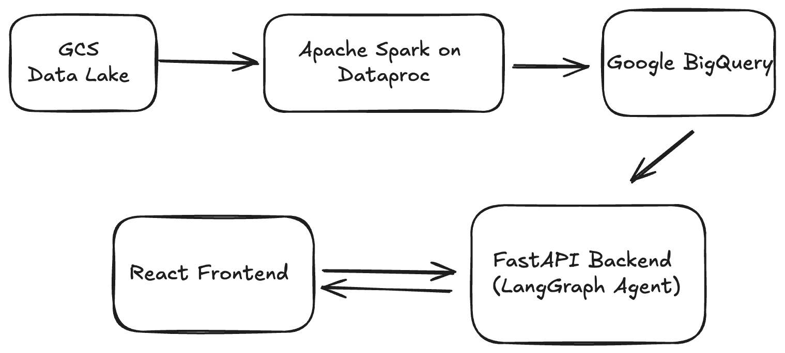

# End-to-End MLOps: Customer Feedback Analysis Platform

This project is a full-stack, cloud-native application designed to ingest, process, and analyze customer feedback at scale. It leverages a modern data engineering pipeline and a sophisticated AI agent to automatically derive business insights—such as sentiment trends and key topics—from raw, unstructured review data. The results are served through an interactive web dashboard.

This platform demonstrates a complete, end-to-end MLOps workflow, from large-scale data processing with Apache Spark to automated CI/CD and deployment on a serverless cloud architecture.

### Architecture Diagram


### AI Agent (LangGraph) Structure
 

## Features

-   **Robust Data Pipeline:** Ingests raw data from a GCS Data Lake, processes it at scale with **Apache Spark**, and stores structured results in **BigQuery**.
-   **Autonomous AI Agent:** Uses **LangGraph** and the **Gemini API** to perform a multi-step analysis chain:
    -   🔍 Fetches relevant data from the BigQuery warehouse.
    -   😊 Performs sentiment analysis on each review.
    -   🏷️ Extracts key topics and themes from the feedback.
    -   ✍️ Generates a concise, executive-level summary of the findings.
-   **Interactive Dashboard:** A **React** frontend with data visualizations (e.g., charts from Recharts) to clearly present the sentiment breakdown and topic frequency.
-   **Automated MLOps:** A complete **CI/CD pipeline** using **GitHub Actions** for automated testing, Docker containerization, and deployment.
-   **Scalable Cloud-Native Deployment:** The entire application is containerized with **Docker** and deployed on **Google Cloud Run**, a serverless platform for scalable, cost-efficient hosting.

## Project Structure

The project is divided into several key directories:

-   `frontend/`: Contains the React application for the user dashboard.
-   `backend/`: Contains the FastAPI application and the LangGraph agent logic.
-   `scripts/`: Contains utility and data processing scripts, including the PySpark job.
-   `data/`: Local directory for raw data files (ignored by Git).
-   `.github/workflows/`: Contains the CI/CD pipeline definitions for GitHub Actions.

## Getting Started

This project consists of two main parts: the one-time data pipeline setup and the running web application.

### Phase 1: Data Pipeline Setup (One-Time)

Before running the web application, you must process the raw data and populate your BigQuery warehouse.

1.  **Set Up GCP:** Ensure you have a Google Cloud project with the **GCS**, **BigQuery**, and **Dataproc** APIs enabled. Authenticate your local environment with `gcloud auth application-default login`.
2.  **Ingest Raw Data:** Place your raw `Reviews.csv` file in the `data/` directory. Run the ingestion script to upload it to your GCS Data Lake bucket.
    ```bash
    python scripts/ingest_to_gcs.py --project=<your-project> --bucket=<your-bucket> --source=data/Reviews.csv
    ```
3.  **Process Data with Spark:** Run the serverless Spark job to process the data from GCS and load the clean results into BigQuery.
    ```bash
    gcloud dataproc batches submit pyspark gs://<your-bucket>/scripts/process_with_spark.py --project=<your-project> --region=<your-region> --version=2.2 --jars=gs://spark-lib/bigquery/spark-3.5-bigquery-0.37.0.jar -- --input_path=gs://<your-bucket>/raw_data/amazon_reviews.csv --output_table=<project>.<dataset>.clean_reviews --gcs_temp_bucket=<your-bucket>
    ```

### Phase 2: Running the Web Application Locally

Once your data is in BigQuery, you can run the application.

1.  **Prerequisites:**
    -   Node.js and npm
    -   Python 3.9+
    -   Docker
    -   Set your **Gemini API Key** in a `.env` file in the `backend/` directory.

2.  **Install Dependencies:**
    -   **Backend:** `cd backend && pip install -r requirements.txt`
    -   **Frontend:** `cd frontend && npm install`

3.  **Run Development Servers:**
    - From the project root, run:
        ```bash
        docker-compose up --build
        ```
    - Open your browser and navigate to `http://localhost:5173`.

## Deployment

This application is designed for automated deployment to **Google Cloud Run** via a CI/CD pipeline defined in **GitHub Actions**.

1.  **On `git push`:** The workflow in `.github/workflows/` is triggered.
2.  **Test & Build:** The pipeline runs backend tests, then builds and tags new Docker images for the frontend and backend.
3.  **Push to Registry:** The new images are pushed to a container registry (e.g., Google Artifact Registry).
4.  **Deploy:** The pipeline then issues a `gcloud run deploy` command to update the Google Cloud Run service with the new container image, resulting in a zero-downtime deployment.

## Technologies Used

-   **Frontend:** React, Vite, Tailwind CSS, Recharts
-   **Backend:** Python, FastAPI, LangGraph
-   **AI/ML:** Google Gemini, Scikit-learn, Pandas
-   **Data Pipeline:** Apache Spark, Google Cloud Storage (Data Lake), Google BigQuery (Data Warehouse)
-   **MLOps & Deployment:** Docker, GitHub Actions (CI/CD), Google Cloud Run, Google Dataproc

## Acknowledgements

This project was developed by building upon and significantly modifying the official `gemini-fullstack-langgraph-quickstart`, which is provided by Google and the LangChain team under the Apache 2.0 License.

## License

This project is licensed under the Apache License 2.0. See the [LICENSE](LICENSE) file for details.
